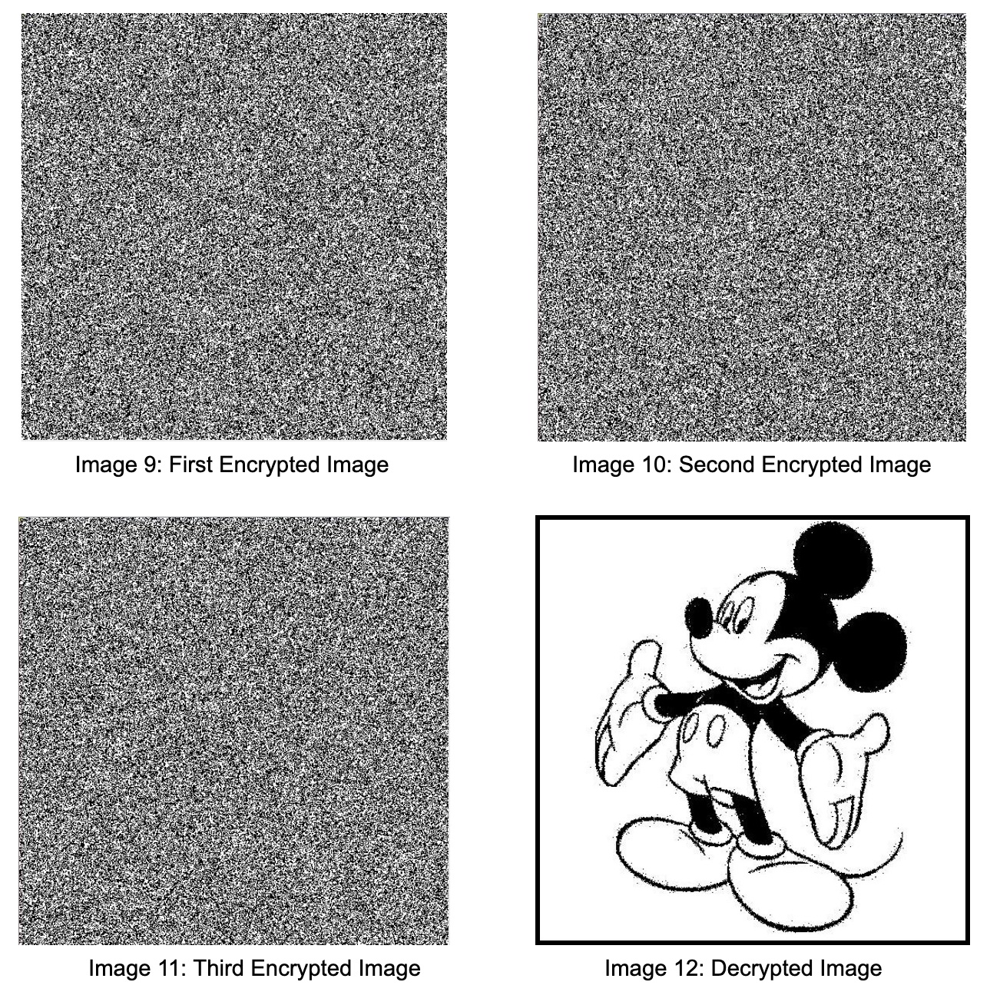

# Visual Cryptography
This project illustrates the concept of visual cryptography (as designed by Moni Naor and Adi Shamir) using 2-bit and 3-bit encryption programs. A photo consisting of only black and white pixels (two bits) is inputted into the program, and two images of seemingly random noise will be generated. The two (or more) images could be layered to create (“decrypt”) the original inputted image using XOR. Written in Java.

Read more about this project [here](https://docs.google.com/document/d/14bMWoPZ7dyAmtYh2j784_z66oFRVDrZUwd0fweVP9Zg/edit?usp=sharing).

